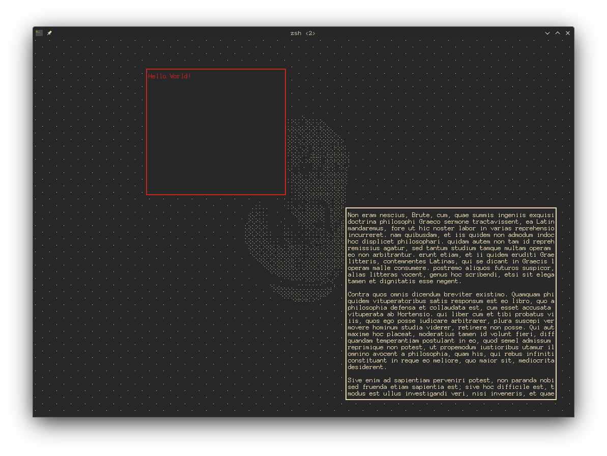

# bevy_terminal_display


[](https://exvacuum.github.io/bevy_terminal_display)

A (very experimental) plugin for the [Bevy](https://bevyengine.org) engine which allows for rendering to a terminal window.

WARNING: I highly recommend using the kitty terminal emulator with this, not only due to the gpu-accelerated rendering, but also the implementation of the kitty protocol which enables the advanced input detection.

Features Include:
- `TerminalDisplayBundle` automatically sets up a correctly-formatted render texture
- Post-process dithers colors to pure black and white, which are then printed as braille characters to the terminal
- Responsiveness to terminal window resizing
- `TerminalInput` resource which keeps track of pressed & released keys
- `Widget` component for rendering ratatui TUI widgets
- `TerminalWidget` trait for creating custom TUI widget components
- Log redirection

## Screenshots

## Compatibility

| Crate Version | Bevy Version |
|---            |---           |
| 0.2           | 0.13         |

## Installation

### Using git URL in Cargo.toml
```toml
[dependencies.bevy_terminal_display]
git = "https://github.com/exvacuum/bevy_terminal_display.git"
```

## Example Usage

In `main.rs`:
```rs
use bevy::prelude::*;
use bevy_terminal_display;

fn main() {
    App::new()
        .add_plugins((
            DefaultPlugins.build().disable::<WinitPlugin>().disable::<LogPlugin>,
            ScheduleRunnerPlugin::run_loop(Duration::from_secs_f32(1.0 / 60.0)),
            bevy_terminal_display::TerminalDisplayPlugin,
        ))
        .insert_resource(Msaa::Off) // For post-process
        .run();
}
```

When spawning a camera:
```rs
let terminal_display_bundle = bevy_terminal_display::display::components::TerminalDisplayBundle::new(3, &asset_server);

commands.spawn((
    Camera3dBundle {
        camera: Camera {
            target: terminal_display_bundle.image_handle().into(),
            ..Default::default()
        },
        ..Default::default()
    },
    terminal_display_bundle,
));
```


